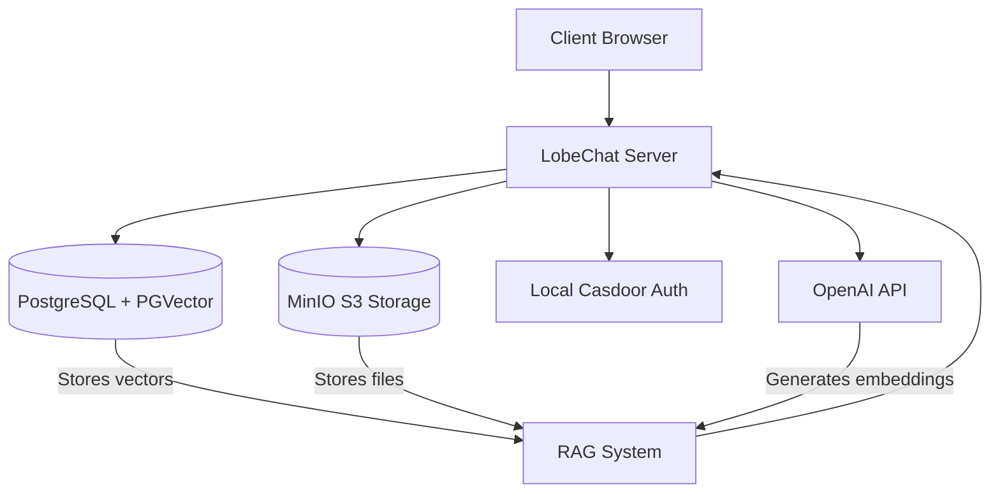
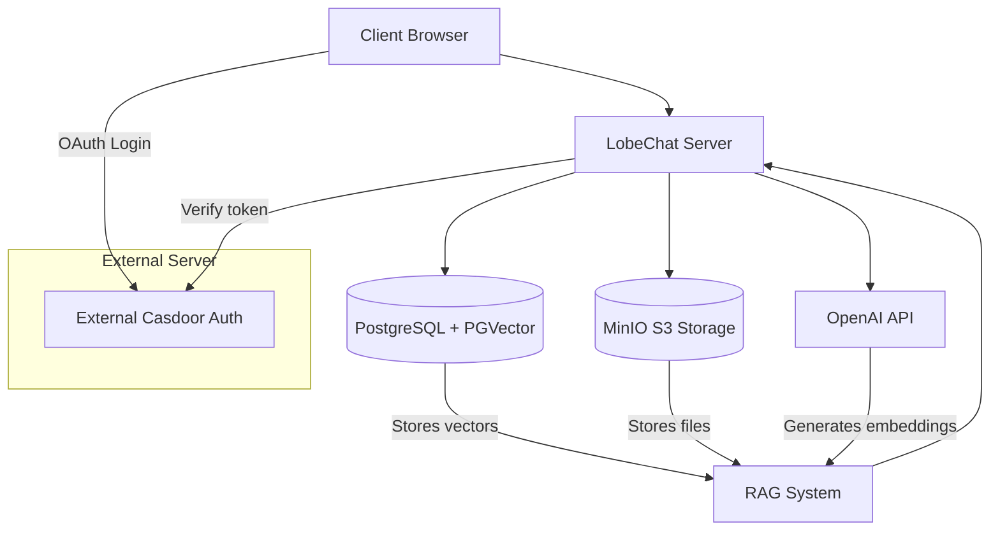

# LobeChat Self-Hosting Implementation with PostgreSQL, RAG, and MinIO

## Overview

This document outlines the implementation plan for deploying LobeChat with a PostgreSQL database, Retrieval-Augmented Generation (RAG) capabilities, and MinIO for S3-compatible storage. The deployment will utilize Docker Compose for containerization and orchestration, making it easy to set up in both development and production environments.

### Core Components

- **LobeChat Application**: The main AI chat interface with multi-modal capabilities
- **PostgreSQL with PGVector**: Database for storing chat data and vector embeddings
- **MinIO**: S3-compatible storage for file uploads and knowledge base documents
- **Casdoor**: Authentication service for user management (now externally hosted)
- **OpenAI Embedding API**: For generating vector embeddings for RAG functionality

### Success Criteria

- Fully functional LobeChat instance with server-side database
- Working authentication system for user management
- Properly configured file upload functionality using MinIO
- Functional RAG implementation with knowledge base features
- Comprehensive documentation for future maintenance and updates

## System Architecture

### Original Architecture (Local Casdoor)



### Updated Architecture (External Casdoor)



## Implementation Checklist

### Phase 1: Environment Setup

- [x] **COMPLETE** Create project directory for deployment
- [x] **COMPLETE** Install Docker and Docker Compose (if not available)
- [x] **COMPLETE** Verify availability of required ports (3210, 8000, 9000, 9001)
- [x] **COMPLETE** Clone or download LobeChat configuration files

### Phase 2: Basic Infrastructure Deployment

- [x] **COMPLETE** Configure environment variables
- [x] **COMPLETE** Deploy PostgreSQL with PGVector
- [x] **COMPLETE** Deploy MinIO service
- [x] **COMPLETE** Configure external Casdoor authentication
- [x] **COMPLETE** Deploy LobeChat application
- [x] **COMPLETE** Verify all services are running correctly

### Phase 3: Service Configuration

- [x] **COMPLETE** Configure PostgreSQL database
- [x] **COMPLETE** Set up MinIO buckets and access policies
- [x] **COMPLETE** Configure Casdoor authentication
- [x] **COMPLETE** Configure LobeChat application settings
- [x] **COMPLETE** Set up OpenAI API access

### Phase 4: RAG Implementation

- [x] **COMPLETE** Configure vector database in PostgreSQL
- [ ] **IN PROGRESS** Set up document processing pipeline
- [x] **COMPLETE** Configure embedding model settings
- [ ] **IN PROGRESS** Test knowledge base creation functionality
- [ ] **IN PROGRESS** Test document upload and processing

## Implementation Status Update (March 6, 2025)

### Current Progress

We have successfully implemented a LobeChat instance with the following characteristics:

- **Database Mode**: Running in server-side database mode with PostgreSQL
- **Authentication**: Using external Casdoor server at https://casdoor.hanthel.com
- **Status**: Chat functionality works correctly with authentication
- **Features**: File management and knowledge base features are now available

### Troubleshooting Notes

We initially tried implementing the system with local Casdoor authentication but encountered several issues:

1. **Authentication Error**: When trying to use local Casdoor, we encountered JavaScript errors in the login page
   ```
   TypeError: Cannot read properties of null (reading 'length')
   at n.value (LoginPage.js:560:21)
   ```

2. **OIDC Configuration Mismatch**: There were mismatches between the expected and actual OIDC issuer configurations
   ```
   [auth][error] r3: "response" body "issuer" property does not match the expected value
   ```

3. **Database Issues**: Local Casdoor had issues connecting to the PostgreSQL database
   ```
   panic: dial tcp 192.168.65.254:3306: connect: connection refused
   ```

### Phase 5: External Casdoor Authentication Implementation

#### 5.1 Current Implementation (March 6, 2025)

After encountering issues with the local Casdoor setup, we moved to using an externally hosted Casdoor server. This approach provides several advantages:

1. **Centralized Authentication**: A single Casdoor instance can manage authentication for multiple apps
2. **Improved Stability**: Separate authentication server is more stable and reliable
3. **Better Security**: Authentication handled by a dedicated service with its own security measures
4. **Easier Maintenance**: Updates to auth system can be performed without affecting the main application

#### 5.2 External Casdoor Configuration

The critical components for external Casdoor authentication are:

1. **Environment Variables** in `.env`:
```
# Casdoor Authentication Settings
AUTH_CASDOOR_ISSUER=https://casdoor.hanthel.com
AUTH_CASDOOR_ID=d861ef0c326a57eeb642
AUTH_CASDOOR_SECRET=cdc5739bb525b67143108b532bad992127008b9e
AUTH_CASDOOR_ENDPOINT=https://casdoor.hanthel.com
NEXT_AUTH_SSO_PROVIDERS=casdoor
```

2. **Docker Compose Configuration**:
- Removed local Casdoor container
- Updated LobeChat service to connect to external Casdoor
- Added connection check to verify external Casdoor availability during startup

3. **Authentication Flow**:
- User accesses LobeChat at http://localhost:3210
- When signing in, user is redirected to https://casdoor.hanthel.com for authentication
- After successful login, Casdoor redirects back to LobeChat with authorization code
- LobeChat verifies the code with Casdoor and creates a session for the user

#### 5.3 Login Credentials

For LobeChat authentication, users should:
1. Create an account in the external Casdoor server or use existing accounts
2. Administrators can manage users through the Casdoor admin panel at https://casdoor.hanthel.com/admin

#### 5.4 Common Authentication Issues and Solutions

Our implementation addresses several common issues:

1. **OIDC Issuer Mismatch**: Ensuring the `AUTH_CASDOOR_ISSUER` environment variable matches exactly with the "issuer" field in Casdoor's OIDC configuration.

2. **Redirect URI Configuration**: Making sure the redirect URIs in the Casdoor application configuration match the actual callback URLs (http://localhost:3210/api/auth/callback/casdoor).

3. **HTTPS Requirements**: Proper handling of HTTPS for secure authentication with the external Casdoor server.

### Phase 6: Testing and Optimization

- [x] **COMPLETE** Test basic chat functionality
- [x] **COMPLETE** Verify authentication with external Casdoor
- [ ] **IN PROGRESS** Test file upload features
- [ ] **IN PROGRESS** Test knowledge base creation and querying
- [ ] **NOT STARTED** Optimize PostgreSQL performance
- [ ] **NOT STARTED** Optimize MinIO configuration
- [ ] **NOT STARTED** Security audit and hardening

### Phase 7: Documentation and Handover

- [x] **COMPLETE** Document external Casdoor configuration
- [ ] **IN PROGRESS** Create user documentation
- [ ] **IN PROGRESS** Document system architecture
- [ ] **NOT STARTED** Create maintenance procedures
- [ ] **NOT STARTED** Document backup and recovery processes
- [ ] **NOT STARTED** Create troubleshooting guide

## Detailed Implementation Plan

### Phase 1: Environment Setup

#### 1.1 Create Project Directory

```bash
mkdir lobe-chat-db && cd lobe-chat-db
```

#### 1.2 Verify Docker Installation

```bash
docker --version
docker-compose --version
```

If not installed, follow the official Docker installation guide for your OS.

#### 1.3 Check Port Availability

Ensure the following ports are available:
- 3210: LobeChat application
- 9000: MinIO API
- 9001: MinIO Console

```bash
# Check if ports are in use
netstat -tuln | grep -E '3210|9000|9001'
```

### Phase 2: Basic Infrastructure Deployment

#### 2.1 Configure Environment Variables

Create or modify the `.env` file with the following configuration:

```
# Core Settings
LOBE_PORT=3210
MINIO_PORT=9000

# Database Configuration
LOBE_DB_NAME=lobechat
POSTGRES_PASSWORD=<secure-password>

# Authentication with External Casdoor
AUTH_CASDOOR_ISSUER=https://casdoor.hanthel.com
AUTH_CASDOOR_ID=d861ef0c326a57eeb642
AUTH_CASDOOR_SECRET=cdc5739bb525b67143108b532bad992127008b9e
AUTH_CASDOOR_ENDPOINT=https://casdoor.hanthel.com
NEXT_AUTH_SSO_PROVIDERS=casdoor

# MinIO Configuration
MINIO_ROOT_USER=<admin-username>
MINIO_ROOT_PASSWORD=<secure-password>
MINIO_LOBE_BUCKET=lobe

# S3 Access for LobeChat
S3_ACCESS_KEY_ID=<generated-key-id>
S3_SECRET_ACCESS_KEY=<generated-access-key>

# OpenAI API (for embeddings and chat)
OPENAI_API_KEY=<your-openai-api-key>

# Security Key for encrypting sensitive data
KEY_VAULTS_SECRET=<generated-secret-key>
```

#### 2.2 Start Docker Compose

```bash
docker-compose up -d
```

#### 2.3 Verify Services

Check if all services are running:

```bash
docker ps
```

Verify logs for each service:

```bash
docker logs -f lobe-chat
docker logs -f lobe-postgres
docker logs -f lobe-minio
```

### Phase 3: Service Configuration

#### 3.1 Configure PostgreSQL Database

The database should be automatically initialized by the LobeChat application. Verify database migration is completed by checking the logs:

```bash
docker logs -f lobe-chat | grep "database migration"
```

#### 3.2 Configure MinIO

1. Access the MinIO Console at http://localhost:9001
2. Login with MINIO_ROOT_USER and MINIO_ROOT_PASSWORD
3. Create a new bucket named "lobe"
4. Create an access policy for the bucket:

```json
{
  "Version": "2012-10-17",
  "Statement": [
    {
      "Effect": "Allow",
      "Principal": {
        "AWS": ["*"]
      },
      "Action": ["s3:GetObject"],
      "Resource": ["arn:aws:s3:::lobe/*"]
    }
  ]
}
```

5. Generate access keys (if not using the ones from .env)
6. Configure CORS settings to allow requests from LobeChat domain:

```
Origin: http://localhost:3210
```

#### 3.3 Configure External Casdoor

1. Access your Casdoor instance at https://casdoor.hanthel.com
2. Login with administrator credentials
3. Configure a new application for LobeChat:
   - Set name and display name to "LobeChat"
   - Add redirect URL: http://localhost:3210/api/auth/callback/casdoor
   - Select appropriate login methods (e.g. password)
   - Save the client ID and secret (d861ef0c326a57eeb642 and cdc5739bb525b67143108b532bad992127008b9e)
4. Create any required user accounts

#### 3.4 Reset and Verify LobeChat Configuration

Run the reset script to apply all configuration changes and connect to the external Casdoor:

```bash
./reset-lobe-with-external-casdoor.sh
```

Verify connectivity using the testing script:

```bash
./test-auth-endpoints.sh
```

### Phase 4: RAG Implementation

#### 4.1 Configure Vector Database

The PGVector extension should be automatically enabled in the PostgreSQL database. Verify by checking the logs of the database container.

#### 4.2 Configure Embedding Model

Set the embedding model in the environment variables:

```
DEFAULT_FILES_CONFIG=embedding_model=openai/embedding-text-3-small
```

#### 4.3 Test Knowledge Base Functionality

1. Log in to LobeChat using your Casdoor credentials
2. Create a new knowledge base
3. Upload test documents
4. Test querying against the knowledge base

## Troubleshooting Guide

### Common Issues

#### Authentication Failures with External Casdoor

```
Failed to authenticate with Casdoor
```

**Solution:**
- Verify the external Casdoor server is accessible
- Check AUTH_CASDOOR_* environment variables match the Casdoor application
- Ensure redirect URI is correctly configured in the Casdoor application
- Try clearing browser cookies and using an incognito window

#### OIDC Configuration Issues

```
Error getting OIDC configuration
```

**Solution:**
- Check connectivity to the external Casdoor server
- Verify the issuer URL is correct and accessible
- Check for SSL/TLS certificate issues if using HTTPS

#### Database Connection Errors

```
[Database] Error connecting to database
```

**Solution:** 
- Verify PostgreSQL container is running
- Check DATABASE_URL environment variable
- Ensure database name matches LOBE_DB_NAME

#### MinIO Access Issues

```
Error uploading file to S3
```

**Solution:**
- Verify MinIO container is running
- Check S3_* environment variables
- Ensure bucket exists and has correct permissions
- Verify CORS configuration allows access from LobeChat domain

#### Vector Database Issues

```
Error in vector search
```

**Solution:**
- Verify PGVector extension is enabled
- Check embedding model configuration
- Ensure OpenAI API key is valid and has access to embedding models

## Conclusion

This implementation now uses an external Casdoor server for authentication, providing a more stable and maintainable solution. The external authentication server offers centralized user management and improved security, while still allowing all the key features of LobeChat to function properly with server-side database storage.

Regular maintenance should focus on:
1. Keeping the external Casdoor server updated and secure
2. Monitoring LobeChat logs for authentication issues
3. Backing up PostgreSQL data and MinIO storage
4. Verifying connectivity between LobeChat and the external Casdoor server

For an optimal experience, follow the provided configuration guidelines and troubleshooting steps as needed.
