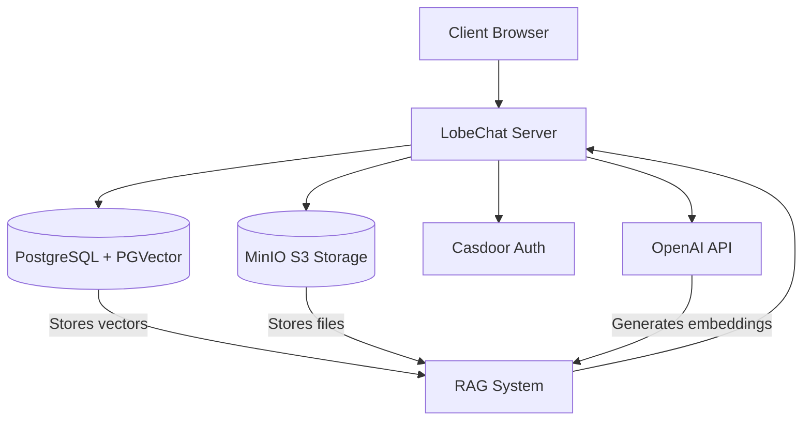

# LobeChat Self-Hosting Implementation with PostgreSQL, RAG, and MinIO

## Overview

This document outlines the implementation plan for deploying LobeChat with a PostgreSQL database, Retrieval-Augmented Generation (RAG) capabilities, and MinIO for S3-compatible storage. The deployment will utilize Docker Compose for containerization and orchestration, making it easy to set up in both development and production environments.

### Core Components

- **LobeChat Application**: The main AI chat interface with multi-modal capabilities
- **PostgreSQL with PGVector**: Database for storing chat data and vector embeddings
- **MinIO**: S3-compatible storage for file uploads and knowledge base documents
- **Casdoor**: Authentication service for user management
- **OpenAI Embedding API**: For generating vector embeddings for RAG functionality

### Success Criteria

- Fully functional LobeChat instance with server-side database
- Working authentication system for user management
- Properly configured file upload functionality using MinIO
- Functional RAG implementation with knowledge base features
- Comprehensive documentation for future maintenance and updates

## System Architecture



## Implementation Checklist

### Phase 1: Environment Setup

- [ ] **NOT STARTED** Create project directory for deployment
- [ ] **NOT STARTED** Install Docker and Docker Compose (if not available)
- [ ] **NOT STARTED** Verify availability of required ports (3210, 8000, 9000, 9001)
- [ ] **NOT STARTED** Clone or download LobeChat configuration files

### Phase 2: Basic Infrastructure Deployment

- [ ] **NOT STARTED** Configure environment variables
- [ ] **NOT STARTED** Deploy PostgreSQL with PGVector
- [ ] **NOT STARTED** Deploy MinIO service
- [ ] **NOT STARTED** Deploy Casdoor authentication service
- [ ] **NOT STARTED** Deploy LobeChat application
- [ ] **NOT STARTED** Verify all services are running correctly

### Phase 3: Service Configuration

- [ ] **NOT STARTED** Configure PostgreSQL database
- [ ] **NOT STARTED** Set up MinIO buckets and access policies
- [ ] **NOT STARTED** Configure Casdoor authentication
- [ ] **NOT STARTED** Configure LobeChat application settings
- [ ] **NOT STARTED** Set up OpenAI API access

### Phase 4: RAG Implementation

- [ ] **NOT STARTED** Configure vector database in PostgreSQL
- [ ] **NOT STARTED** Set up document processing pipeline
- [ ] **NOT STARTED** Configure embedding model settings
- [ ] **NOT STARTED** Test knowledge base creation functionality
- [ ] **NOT STARTED** Test document upload and processing

### Phase 5: Testing and Optimization

- [ ] **NOT STARTED** Test basic chat functionality
- [ ] **NOT STARTED** Test file upload features
- [ ] **NOT STARTED** Test knowledge base creation and querying
- [ ] **NOT STARTED** Optimize PostgreSQL performance
- [ ] **NOT STARTED** Optimize MinIO configuration
- [ ] **NOT STARTED** Security audit and hardening

### Phase 6: Documentation and Handover

- [ ] **NOT STARTED** Create user documentation
- [ ] **NOT STARTED** Document system architecture
- [ ] **NOT STARTED** Create maintenance procedures
- [ ] **NOT STARTED** Document backup and recovery processes
- [ ] **NOT STARTED** Create troubleshooting guide

## Detailed Implementation Plan

### Phase 1: Environment Setup

#### 1.1 Create Project Directory

```bash
mkdir lobe-chat-db && cd lobe-chat-db
```

#### 1.2 Verify Docker Installation

```bash
docker --version
docker-compose --version
```

If not installed, follow the official Docker installation guide for your OS.

#### 1.3 Check Port Availability

Ensure the following ports are available:
- 3210: LobeChat application
- 8000: Casdoor authentication
- 9000: MinIO API
- 9001: MinIO Console

```bash
# Check if ports are in use
netstat -tuln | grep -E '3210|8000|9000|9001'
```

### Phase 2: Basic Infrastructure Deployment

#### 2.1 Download Setup Script

```bash
bash <(curl -fsSL https://lobe.li/setup.sh) -l en
```

#### 2.2 Configure Environment Variables

Create or modify the `.env` file with the following configuration:

```
# Core Settings
LOBE_PORT=3210
CASDOOR_PORT=8000
MINIO_PORT=9000

# Database Configuration
LOBE_DB_NAME=lobechat
POSTGRES_PASSWORD=<secure-password>

# Authentication
AUTH_CASDOOR_ID=<generated-id>
AUTH_CASDOOR_SECRET=<generated-secret>

# MinIO Configuration
MINIO_ROOT_USER=<admin-username>
MINIO_ROOT_PASSWORD=<secure-password>
MINIO_LOBE_BUCKET=lobe

# S3 Access for LobeChat
S3_ACCESS_KEY_ID=<generated-key-id>
S3_SECRET_ACCESS_KEY=<generated-access-key>

# OpenAI API (for embeddings and chat)
OPENAI_API_KEY=<your-openai-api-key>

# Security Key for encrypting sensitive data
KEY_VAULTS_SECRET=<generated-secret-key>
```

#### 2.3 Start Docker Compose

```bash
docker compose up -d
```

#### 2.4 Verify Services

Check if all services are running:

```bash
docker ps
```

Verify logs for each service:

```bash
docker logs -f lobe-chat
docker logs -f lobe-postgres
docker logs -f lobe-minio
docker logs -f lobe-casdoor
```

### Phase 3: Service Configuration

#### 3.1 Configure PostgreSQL Database

The database should be automatically initialized by the LobeChat application. Verify database migration is completed by checking the logs:

```bash
docker logs -f lobe-chat | grep "database migration"
```

#### 3.2 Configure MinIO

1. Access the MinIO Console at http://localhost:9001
2. Login with MINIO_ROOT_USER and MINIO_ROOT_PASSWORD
3. Create a new bucket named "lobe"
4. Create an access policy for the bucket:

```json
{
  "Version": "2012-10-17",
  "Statement": [
    {
      "Effect": "Allow",
      "Principal": {
        "AWS": ["*"]
      },
      "Action": ["s3:GetObject"],
      "Resource": ["arn:aws:s3:::lobe/*"]
    }
  ]
}
```

5. Generate access keys (if not using the ones from .env)
6. Configure CORS settings to allow requests from LobeChat domain:

```
Origin: http://localhost:3210
```

#### 3.3 Configure Casdoor

1. Access Casdoor at http://localhost:8000
2. Login with admin credentials provided during setup
3. Create a new organization named "Lobe Users"
4. Configure a new application for LobeChat:
   - Set name and display name to "LobeChat"
   - Add redirect URL: http://localhost:3210/api/auth/callback/casdoor
   - Select appropriate login methods (e.g. password)
   - Save the client ID and secret to .env file

#### 3.4 Configure LobeChat Settings

LobeChat should automatically connect to the configured services. Verify by accessing http://localhost:3210 and checking if you can log in with a user account.

### Phase 4: RAG Implementation

#### 4.1 Configure Vector Database

The PGVector extension should be automatically enabled in the PostgreSQL database. Verify by checking the logs of the database container.

#### 4.2 Configure Embedding Model

Set the embedding model in the environment variables:

```
DEFAULT_FILES_CONFIG=embedding_model=openai/embedding-text-3-small
```

#### 4.3 Test Knowledge Base Functionality

1. Log in to LobeChat
2. Create a new knowledge base
3. Upload test documents
4. Test querying against the knowledge base

### Phase 5: Testing and Optimization

#### 5.1 Performance Testing

Test the system under various loads:
- Multiple concurrent users
- Large file uploads
- Complex knowledge base queries

#### 5.2 Optimization

Optimize based on testing results:
- Adjust PostgreSQL configuration for better vector search performance
- Configure MinIO caching for frequently accessed files
- Tune embedding chunk size for optimal RAG performance

#### 5.3 Security Hardening

- Review access controls
- Implement HTTPS if deploying to production
- Secure database and S3 credentials
- Limit user registration if needed

### Phase 6: Production Considerations (if applicable)

For deploying to production:

#### 6.1 Domain Configuration

Configure reverse proxy with proper domains:
- Main domain for LobeChat (e.g., lobe.example.com)
- Auth domain for Casdoor (e.g., auth.example.com)
- S3 domain for MinIO (e.g., s3.example.com)

#### 6.2 HTTPS Configuration

Implement SSL certificates for all domains, either through:
- Let's Encrypt with certbot
- Existing SSL certificates
- Cloudflare or similar services

#### 6.3 Backup Strategy

Implement regular backups for:
- PostgreSQL database
- MinIO storage
- Application configuration

## Status Update Template

Use the following template for regular status updates:

```
# LobeChat Implementation Status - DATE

## Overall Progress
- Phase 1: COMPLETE
- Phase 2: IN PROGRESS (80%)
- Phase 3: NOT STARTED
- Phase 4: NOT STARTED
- Phase 5: NOT STARTED
- Phase 6: NOT STARTED

## Recent Accomplishments
- Set up Docker environment
- Deployed PostgreSQL with PGVector
- Configured MinIO buckets

## Current Issues
- ERROR: Unable to connect to Casdoor - investigating network issue
- BLOCKED: Waiting for OpenAI API key

## Next Steps
- Complete Casdoor configuration
- Begin LobeChat application setup
```

## Troubleshooting Guide

### Common Issues

#### Database Connection Errors

```
[Database] Error connecting to database
```

**Solution:** 
- Verify PostgreSQL container is running
- Check DATABASE_URL environment variable
- Ensure database name matches LOBE_DB_NAME

#### MinIO Access Issues

```
Error uploading file to S3
```

**Solution:**
- Verify MinIO container is running
- Check S3_* environment variables
- Ensure bucket exists and has correct permissions
- Verify CORS configuration allows access from LobeChat domain

#### Authentication Failures

```
Failed to authenticate with Casdoor
```

**Solution:**
- Verify Casdoor container is running
- Check AUTH_CASDOOR_* environment variables
- Ensure redirect URI is correctly configured in Casdoor
- Check for network connectivity between services

#### Vector Database Issues

```
Error in vector search
```

**Solution:**
- Verify PGVector extension is enabled
- Check embedding model configuration
- Ensure OpenAI API key is valid and has access to embedding models

## Conclusion

This implementation plan provides a comprehensive approach to deploying LobeChat with PostgreSQL and RAG capabilities using MinIO for storage. By following the phases and regularly updating the checklist, the development team can track progress and address issues promptly.

For an optimal experience, regular communication about progress, blockers, and completed tasks is recommended.
